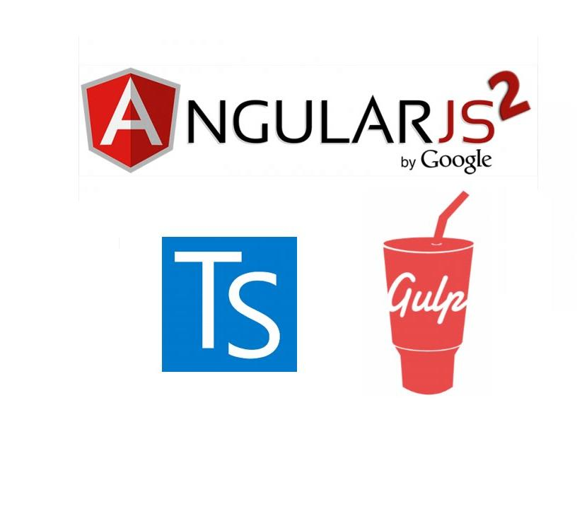

Angular2 with TypeScript and Gulp
=================================

A basic Angular2 application with Gulp as build system.

#### 1. Prerequisites

*nodejs* must be installed on your system and the below global node packages must be installed:

- gulp

> npm i -g gulp

- gulp-cli

> npm i -g gulp-cli

- typings

> npm i -g typings

- typescript

> npm i -g typescript

- ts-node

> npm i -g ts-node

Clone the repository 

> $ git clone https://github.com/planetofwebdesign/angular2-stable-sample-project.git

Navigate to `angular2-stable-sample-project` directory:

> cd angular2-stable-sample-project

#### 3. Installing dependencies

Install dependencies by running the following command:

> npm install

`node_modules` and `typings` directories will be created during the install.

#### 4. Building the project

Build the project by running the following command:

> npm run clean & npm run build

`build` directory will be created during the build

#### 5. Starting the application

Start the application by running the following command:

> npm start

The application will be displayed in the browser.

